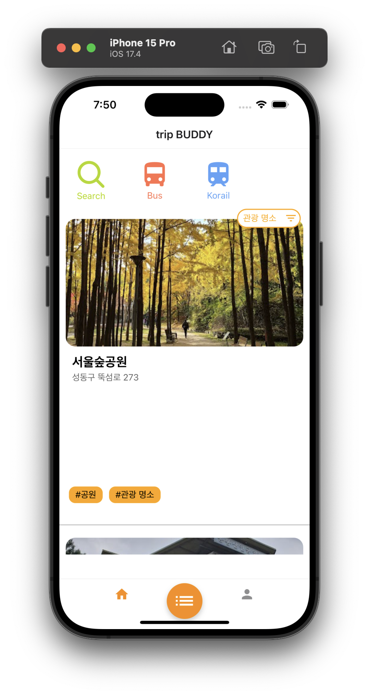

# 🌍 TravelBUDDY - 여행 계획 & 공유 iOS 앱

**React Native와 Firebase로 구현된 여행 계획 앱 TravelBUDDY는 친구와 함께 여행을 계획하고 관리할 수 있는 스마트한 방법을 제공합니다.**

## 📱 기능 소개

### 1️⃣ 홈 화면 (여행지 추천)

사용자 위치 기반 추천: 현재 위치를 기준으로 주변의 여행지 목록을 확인할 수 있습니다.
태그 필터링: 여행지에는 다양한 태그(예: 관광 명소, 카페, 숙박, 식당, 캠핑장)가 포함되어 있으며, 태그별로 여행지를 필터링할 수 있습니다.
검색 기능: 상단의 검색 버튼을 통해 특정 여행지를 찾아볼 수 있습니다.

### 2️⃣ 여행 계획 관리
나의 여행 계획: 사용자가 생성한 여행 목록을 확인할 수 있습니다.
초대받은 여행: 친구가 초대한 여행 계획을 한눈에 확인할 수 있습니다.
*(초대받은 사용자는 읽기만 가능합니다.)*

### 3️⃣ 여행 일정 구성
장소 추가: 여행지를 검색해 여행 일정에 추가할 수 있습니다.
카테고리별 구성:
- *여행지*
- *이동수단*
- *숙소*
- *식당*

날짜별 정렬: 여행 일정이 날짜 순으로 자동 정렬됩니다.

### 4️⃣ 채팅 기능
그룹 채팅: 여행에 참여 중인 사람들과 실시간으로 소통할 수 있습니다.
1:1 채팅: 개별 채팅을 통해 더 깊은 소통이 가능합니다.

## 🛠️ 기술 스택

프론트엔드
React Native *(ios)*

백엔드 및 데이터베이스
Firebase

사용자 인증

실시간 데이터베이스

채팅 기능

API *(Google Places API)*
- 사용자 위치를 기반으로 여행지 정보를 제공합니다.
