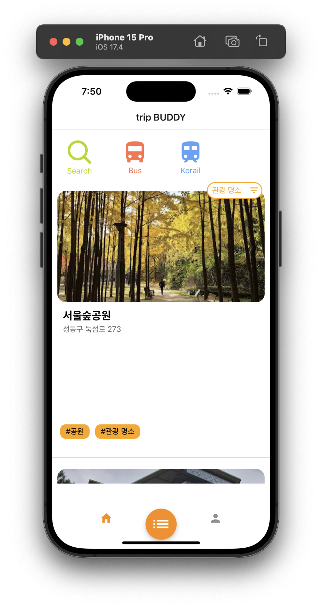
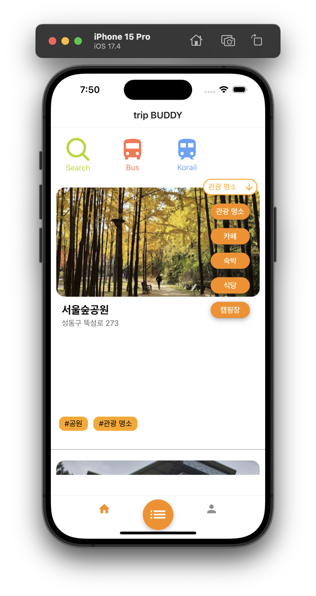
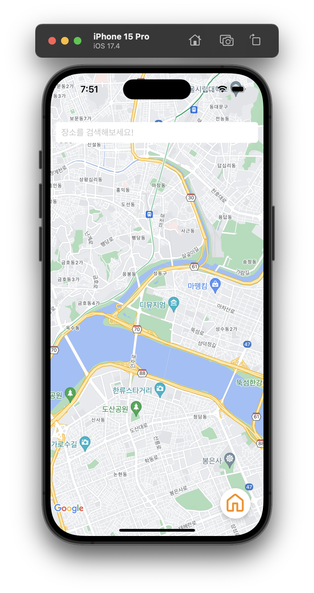
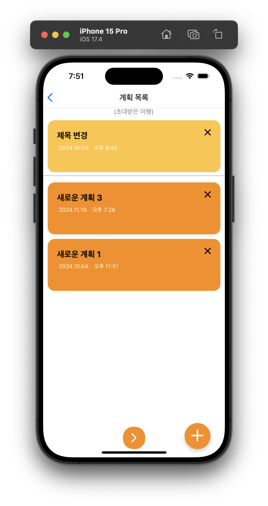
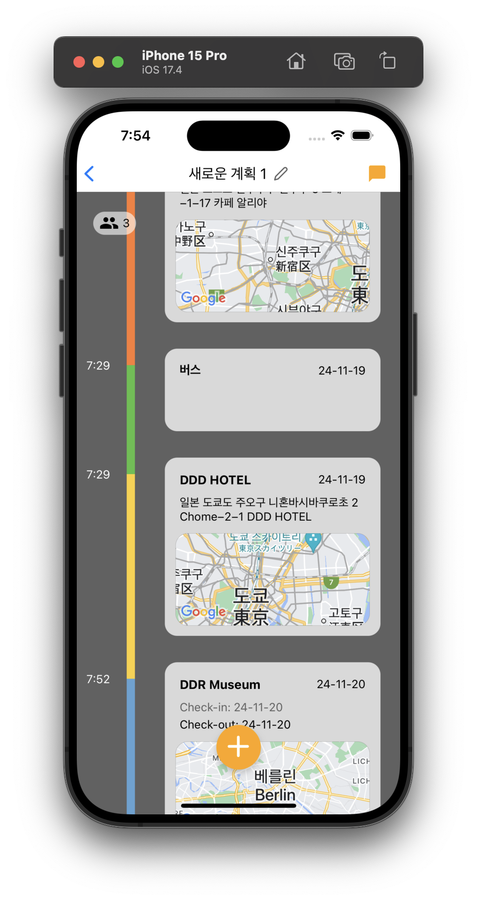
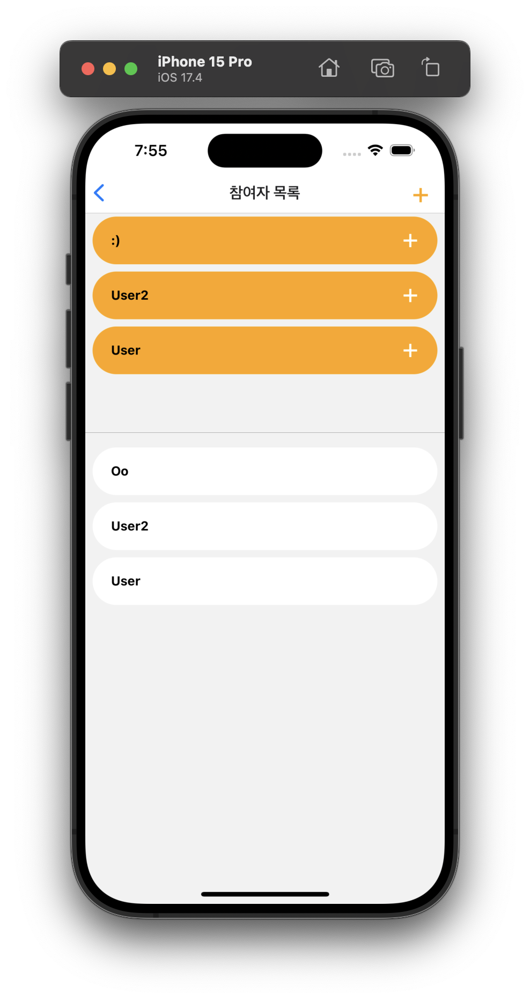
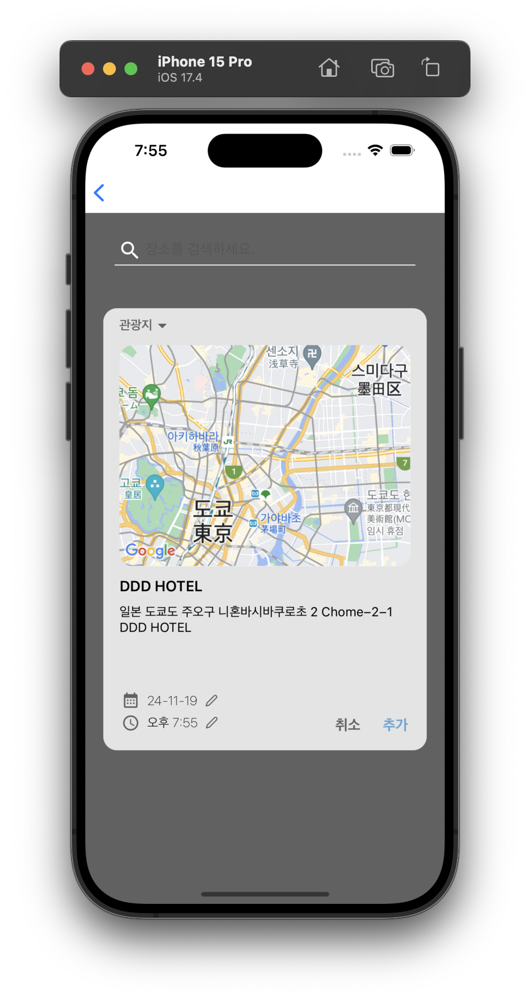
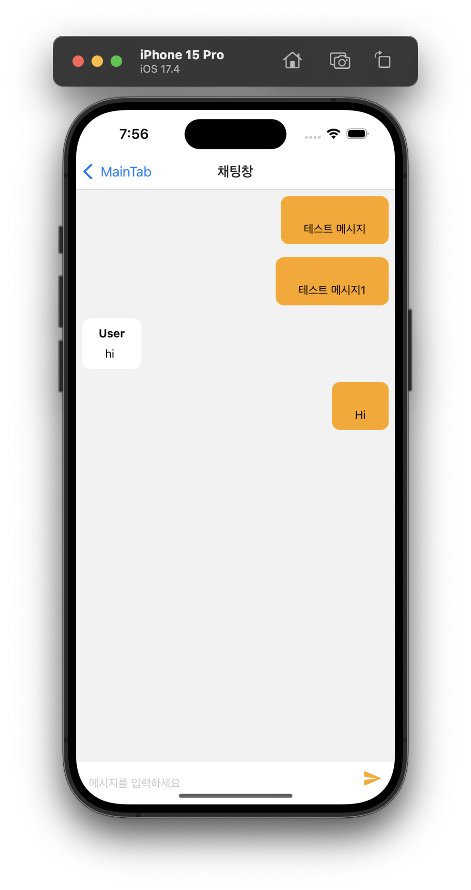
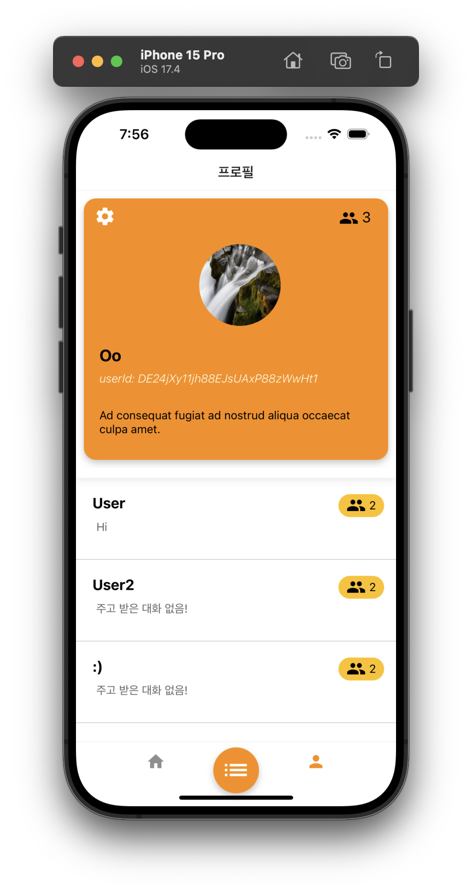
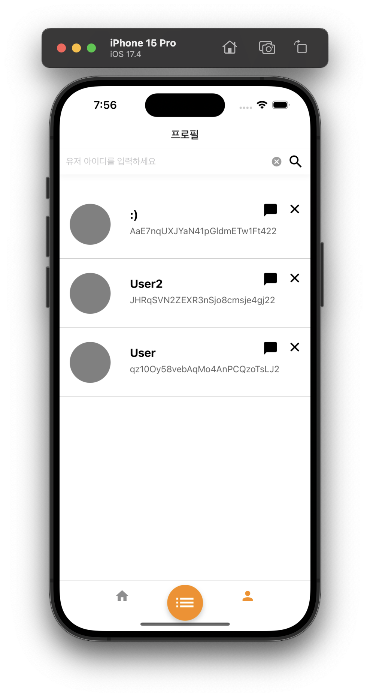

# 🌍 TravelBUDDY - 여행 계획 & 공유 iOS 앱

**TravelBUDDY는 React Native와 Firebase를 기반으로,
여행지 탐색부터 일정 구성, 실시간 소통까지 하나의 흐름으로 연결한 모바일 여행 협업 서비스입니다.**

## ⚙️ Core Features & Technical Highlights
### 📍 위치 기반 여행지 추천
Google Maps / Places API를 활용하여 **사용자의 실시간 좌표(위도·경도)**를 기준으로 인근 여행지를 우선 노출
태그 기반 필터링 및 검색 기능을 통해 사용자가 원하는 장소를 빠르게 탐색 가능

### 🚀 대규모 리스트 성능 최적화
여행지 데이터 증가에 따라 발생한 메모리 과부하 및 프레임 드랍 문제를 해결하기 위해
기본 FlatList 대신 OptimizedFlatList를 적용
렌더링 제한 및 뷰 재사용 전략을 통해 초기 로딩 성능 및 메모리 사용 안정화

### 🗓️ 여행 일정 관리
여행지 / 이동수단 / 숙소 / 식당 등 카테고리 기반 일정 구성
날짜 기준 자동 정렬을 통해 일정 가독성 향상
초대된 사용자는 읽기 전용으로 접근 가능하여 권한 분리

### 💬 실시간 채팅
Firebase Firestore의 실시간 리스너를 활용한 1:1 / 그룹 채팅 구현

## 📱 기능 소개

### 1️⃣ 홈 화면 (여행지 추천)

사용자 위치 기반 추천: 현재 위치를 기준으로 주변의 여행지 목록을 확인할 수 있습니다.
태그 필터링: 여행지에는 다양한 태그(예: 관광 명소, 카페, 숙박, 식당, 캠핑장)가 포함되어 있으며, 태그별로 여행지를 필터링할 수 있습니다.

검색 기능: 상단의 검색 버튼을 통해 특정 여행지를 찾아볼 수 있습니다.

### 2️⃣ 여행 계획 관리

나의 여행 계획: 사용자가 생성한 여행 목록을 확인할 수 있습니다.

초대받은 여행: 친구가 초대한 여행 계획을 한눈에 확인할 수 있습니다.
*(초대받은 사용자는 읽기만 가능합니다.)*

### 3️⃣ 여행 일정 구성

장소 추가: 여행지를 검색해 여행 일정에 추가할 수 있습니다.
카테고리별 구성:
- *여행지*
- *이동수단*
- *숙소*
- *식당*

날짜별 정렬: 여행 일정이 날짜 순으로 자동 정렬됩니다.

### 4️⃣ 채팅 기능

그룹 채팅: 여행에 참여 중인 사람들과 실시간으로 소통할 수 있습니다.
1:1 채팅: 개별 채팅을 통해 더 깊은 소통이 가능합니다.

##🛠️ Tech Stack

Frontend: React Native (iOS)
Backend / DB: Firebase
API: Google Places API
Collaboration: Git, Git Flow

## 📂 파일 구조

/src/components/: UI의 일관성과 재사용성을 위해 분리된 공통 컴포넌트 (입력창, 일정 상세 버튼 등)

/src/pages/: 서비스의 핵심 기능을 담당하는 메인 스크린 (Home, Chat, FriendsList 등)

/src/context/: Context API를 활용하여 검색 상태 및 사용자 데이터를 전역적으로 관리

/src/lib/: Firebase SDK 연동을 모듈화하여 인증(Auth) 및 DB(Firestore) 로직을 분리 관리

/src/utils/: 사용자 권한 체크 및 데이터 정렬 등 독립적인 비즈니스 로직 처리

src/welcome/: 앱 온보딩 및 초기 진입 프로세스
